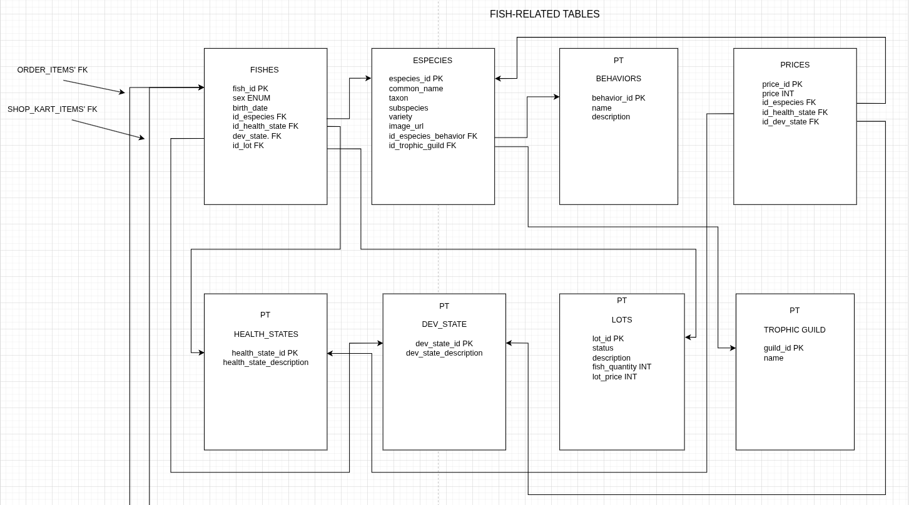
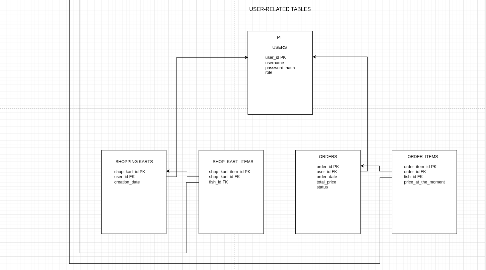
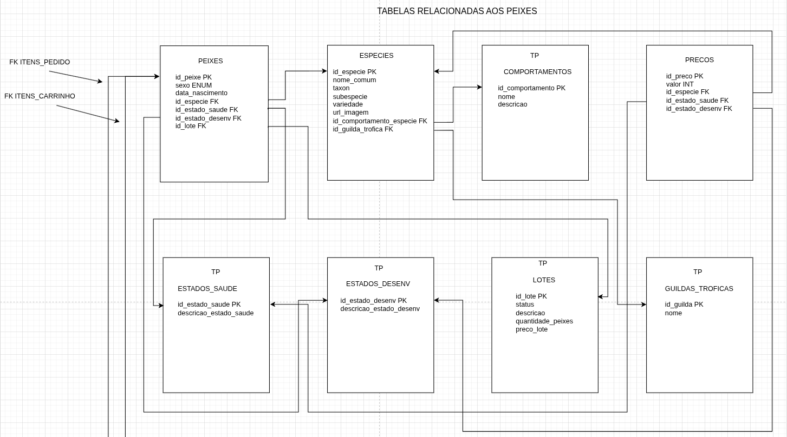
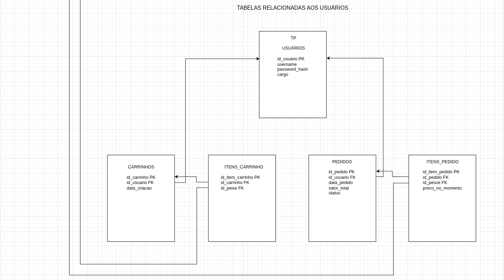

#[EN-US] (Versão em português abaixo)
# 🐟 E-Commerce API - Fish Sales System

A RESTful API developed in **.NET 10** to serve as the back-end for an e-commerce platform specialized in selling fish. The system covers everything from catalog management, species, batches, and animal health status, to shopping cart control, orders, and user authentication.

Disclamer: The strange name of the API and it's relative entity ('Pesces') in the database is just an inside joke.

## 🚀 Technologies and Architecture

This project was built to consolidate back-end development knowledge using the .NET ecosystem, employing the following technologies:

* **Platform:** .NET 10
* **Framework:** ASP.NET Core Web API
* **Language:** C#
* **ORM:** Entity Framework Core (EF Core)
* **Database:** PostgreSQL (via Npgsql)
* **Security:** Authentication and Authorization via JWT (JSON Web Tokens)
* **Documentation:** Swagger (OpenAPI)

The project architecture follows the **N-Tier** pattern, ensuring the separation of concerns:
* **Controllers:** Exposes HTTP endpoints and routing.
* **Services:** Centralizes business rules (e.g., inventory validation, cart rules).
* **Models:** Entities representing the domain problem and database mapping.
* **DTOs (Data Transfer Objects):** Input and output data shapes to prevent over-posting and protect real entities.

## 📊 Database Structure

The relational database consists of 13 main tables, logically divided into two domains:

1. **Catalog/Inventory Domain:** Manages `Especies` (Species), `Pesces` (physical fish inventory), `Lotes` (Batches), `Precos` (Prices), and biological characteristics such as `Guildas_Troficas` (Trophic Guilds), `Comportamentos` (Behaviors), `Estados_Saude` (Health Statuses), and `Estados_Desenvolvimento` (Development Stages).

2. **Sales Domain:** Controls `Usuarios` (Users, with role distinctions), `Carrinhos` (Shopping Carts), `Itens_Carrinho` (Cart Items), `Pedidos` (Orders), and `Itens_Pedido` (Order Items).

### 🛡️ Data Integrity & Raw SQL Schema
While the API utilizes Entity Framework Core for ORM and data access, the database schema was deliberately designed with strict relational rules to guarantee data integrity at the database level. 

The original SQL DDL script used to construct the architecture is available in the [`/scripts/schema.sql`](./scripts/schema.sql) file. This script highlights the implementation of:
* **Business Logic via Constraints:** Usage of `CHECK` constraints to validate data upon insertion (e.g., validating fish gender and strict order statuses).
* **Duplication Prevention:** Strategic use of `UNIQUE` constraints to ensure, for example, that a single physical fish cannot exist in two different carts simultaneously or be sold twice.
* **Relational Mapping:** Strict `FOREIGN KEY` implementations and `DEFAULT` value assignments for consistent state management.

## ⚙️ How to Run the Project Locally

### Prerequisites
* [.NET 10 SDK](https://dotnet.microsoft.com/download)
* [PostgreSQL](https://www.postgresql.org/download/) running locally (default port 5432).

### Installation Steps

1. **Clone the repository:**
   ```bash
   git clone https://github.com/CelestialHarp/api-db-peixes.git
   cd YOUR_REPOSITORY
   ```

2. **Configuration (`appsettings.json`):**
   Create an `appsettings.json` file in the root of the project (if it doesn't exist) and configure your PostgreSQL connection string:
   ```json
   {
     "ConnectionStrings": {
       "DefaultConnection": "Host=localhost;Database=DB_PESCES;Username=YOUR_POSTGRES_USER;Password=YOUR_POSTGRES_PASSWORD"
     },
     "Jwt": {
       "Key": "default_super_secret_key_very_long_123"
     }
   }
   ```

3. **Restore packages and create the Database:**
   Open the terminal in the project folder and run the EF Core migrations:
   ```bash
   dotnet restore
   dotnet ef database update
   ```
   *The API has an integrated `DbSeeder`. When running the project for the first time, it will automatically populate the database with initial data (species, behaviors, and an admin user).*

4. **Run the application:**
   ```bash
   dotnet run
   ```

5. **Test the API:**
   Access Swagger in your browser at `http://localhost:<port>/swagger`. You can use the test user (Username: `username`, Password: `password`) on the Login endpoint to generate a JWT token and test protected routes.

## 🛠️ Known Technical Debt & Roadmap

As this is an evolving project, some points are already mapped out for future improvements:
* **[TD001] Naming Standardization:** The project mixes terms in Portuguese, "Portunhol" (e.g., `Pesces`), and english due to inside jokes during early development (I coudn't stand building a project this big alone without some fun). A global refactoring to English is planned to align with market standards (I'll try to do it with the lastest thing I've learned: regular expressions).
* **[TD002] Testing:** Implementation of unit tests (xUnit/Moq) in the Services layer.
* **[TD003] Secrets Management:** Strictly move all keys (like the JWT fallback) to environment variables outside the source code. (I think I already solved it but I'm still to check it)

## ✅ Solved Technical Debt:
* **[TD001](partial)** Removed the 'pesces' inside joke, and padronized it all to portuguese in order for me to translate to english.

Developed with perspicacity and much effort by Tarcyzio da Fonsêca Oliveira. https://www.linkedin.com/in/tarcyzio-da-fonseca-oliveira/

#[PT-BR]
# 🐟 E-Commerce API - Sistema de Venda de Peixes

Uma API RESTful desenvolvida em **.NET 10** para atuar como o back-end de um e-commerce especializado na venda de peixes. O sistema abrange desde o gerenciamento de catálogo, espécies, lotes e estado de saúde dos animais, até o controle de carrinho de compras, pedidos e autenticação de usuários.

Disclamer: O nome estranho da API e sua entidade relativa (Peixes, que eu troquei por Pesces) na database é só uma piada interna.

## 🚀 Tecnologias e Arquitetura

Este projeto foi construído para consolidar conhecimentos em desenvolvimento back-end utilizando o ecossistema .NET, empregando as seguintes tecnologias:

* **Plataforma:** .NET 10
* **Framework:** ASP.NET Core Web API
* **Linguagem:** C#
* **ORM:** Entity Framework Core (EF Core)
* **Banco de Dados:** PostgreSQL (via Npgsql)
* **Segurança:** Autenticação e Autorização via JWT (JSON Web Tokens)
* **Documentação:** Swagger (OpenAPI)

A arquitetura do projeto segue o padrão **N-Tier** (Camadas), garantindo a separação de responsabilidades:
* **Controllers:** Exposição dos endpoints HTTP e roteamento.
* **Services:** Centralização das regras de negócio (ex: validação de estoque, regras de carrinho).
* **Models:** Entidades que representam o domínio do problema e mapeamento do banco de dados.
* **DTOs (Data Transfer Objects):** Moldes de entrada e saída de dados para evitar over-posting e proteger as entidades reais.

## 📊 Estrutura do Banco de Dados

O banco de dados relacional é composto por 13 tabelas principais, divididas logicamente em dois domínios:

1. **Domínio de Catálogo/Estoque:** Gerencia as `Especies`, `Pesces` (estoque físico), `Lotes`, `Precos`, e características biológicas como `Guildas_Troficas`, `Comportamentos`, `Estados_Saude` e `Estados_Desenvolvimento`.

2. **Domínio de Vendas:** Controla `Usuarios` (com distinção de cargos/roles), `Carrinhos`, `Itens_Carrinho`, `Pedidos` e `Itens_Pedido`.


### 🛡️ Integridade de Dados e Esquema SQL Bruto
Embora a API utilize o Entity Framework Core para ORM e acesso a dados, o esquema do banco de dados foi deliberadamente projetado com regras relacionais rigorosas para garantir a integridade dos dados no nível do banco de dados.

O script DDL SQL original usado para construir a arquitetura está disponível no arquivo [`/scripts/schema.sql`](./scripts/schema.sql). Este script destaca a implementação de:
* **Lógica de Negócios via Restrições:** Uso de restrições `CHECK` para validar dados na inserção (por exemplo, validar o sexo do peixe e os status de pedidos).

* **Prevenção de Duplicação:** Uso estratégico de restrições `UNIQUE` para garantir, por exemplo, que um único peixe físico não possa existir em dois carrinhos diferentes simultaneamente ou ser vendido duas vezes.

* **Mapeamento Relacional:** Implementações rigorosas de `FOREIGN KEY` e atribuições de valores `DEFAULT` para gerenciamento de estado consistente.

## ⚙️ Como Executar o Projeto Localmente

### Pré-requisitos
* [.NET 10 SDK](https://dotnet.microsoft.com/download)
* [PostgreSQL](https://www.postgresql.org/download/) rodando localmente (porta padrão 5432).

### Passos para Instalação

1. **Clone o repositório:**
   ```bash
   git clone https://github.com/CelestialHarp/api-db-peixes.git
   cd SEU_REPOSITORIO
   ```

2. **Configuração (`appsettings.json`):**
   Crie um arquivo `appsettings.json` na raiz do projeto (caso não exista) e configure a sua string de conexão com o PostgreSQL:
   ```json
   {
     "ConnectionStrings": {
       "DefaultConnection": "Host=localhost;Database=DB_PESCES;Username=SEU_USUARIO_POSTGRES;Password=SUA_SENHA_POSTGRES"
     },
     "Jwt": {
       "Key": "chave_super_secreta_padrao_muito_longa_123"
     }
   }
   ```

3. **Restaurar pacotes e criar o Banco de Dados:**
   Abra o terminal na pasta do projeto e execute as migrations do EF Core:
   ```bash
   dotnet restore
   dotnet ef database update
   ```
   *A API possui um `DbSeeder` integrado. Ao rodar o projeto pela primeira vez, ele populará automaticamente o banco com dados iniciais (espécies, comportamentos e um usuário admin).*

4. **Rodar a aplicação:**
   ```bash
   dotnet run
   ```

5. **Testar a API:**
   Acesse o Swagger no seu navegador através de `http://localhost:<porta>/swagger`. Você pode usar o usuário de teste (Username: `username`, Password: `password`) no endpoint de Login para gerar um token JWT e testar rotas protegidas.

## 🛠️ Dívidas Técnicas Conhecidas (Tech Debt) e Roadmap

Como este é um projeto em evolução, alguns pontos já estão mapeados para futuras melhorias:
* **Padronização de Nomenclatura:** O projeto usa termos em português e alguns termos em inglês. Uma refatoração global para inglês está prevista para adequação aos padrões de mercado (Vou tentar fazê-la com a última coisa que aprendi: expressões regulares).
* **Testes:** Implementação de testes unitários (xUnit/Moq) na camada de Services.
* **Gerenciamento de Secrets:** Mover de forma estrita todas as chaves (como o fallback do JWT) para variáveis de ambiente fora do código-fonte. (acho que já fiz isso, depois eu checo)

## ✅ Dívida técnica quitada
* [DT001](parcial): Retirei a piada interna "pesces", exceto da APi e do nome do banco pois são apenas o nome do banco e da API, não influem muito nos algoritmos.

Desenvolvido com perspicácia e muito esforço por Tarcyzio da Fonsêca Oliveira. https://www.linkedin.com/in/tarcyzio-da-fonseca-oliveira/
